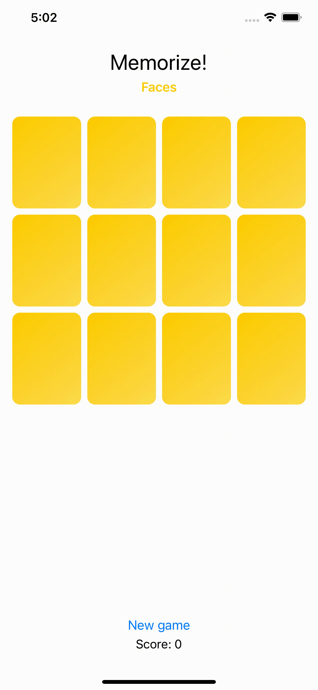

# Assignment 2

Build a working memory game.

> The goal of this assignment is to continue to recreate the demonstrations given in the first four lectures and then make some bigger enhancements.

## Screenshots

### Folders

- [Memorize](./Memorize) - Contains the Xcode project
- [assignment-pdfs](./assignment-pdfs) - Contains the assignments (reading and coding)

#### Notes:
- All required tasks were developed
- The business logic is covered by unit tests 
- The extra credit assignments 1, 2, and 3 were developed (search for "Extra-credit" in the source code)

